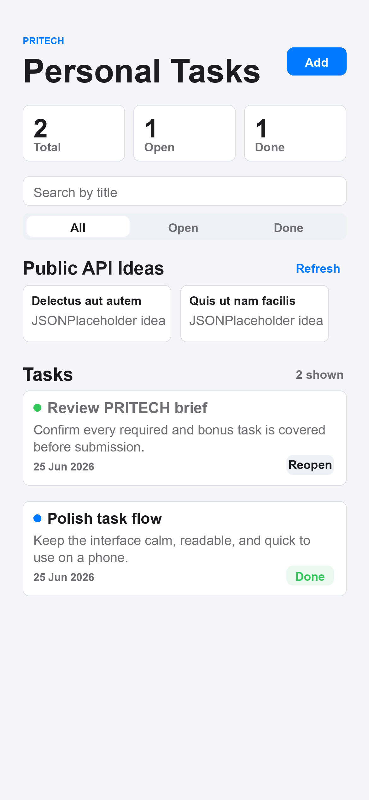
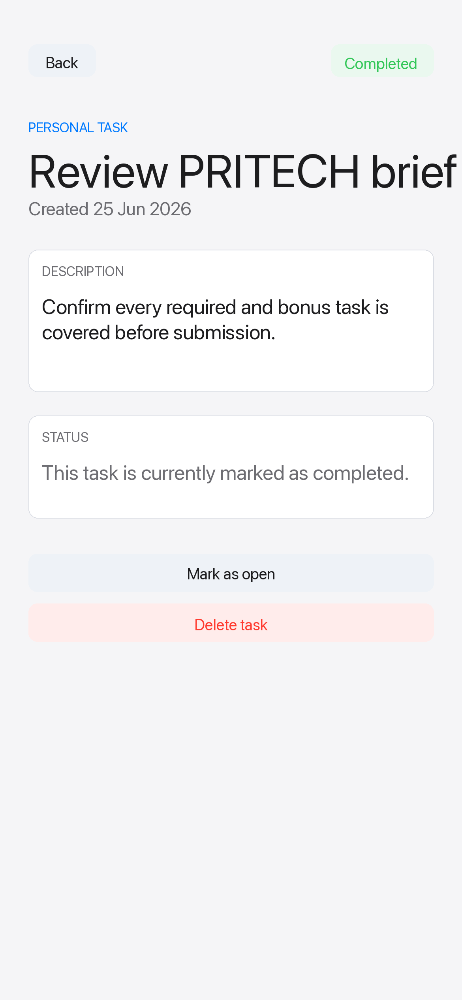

# PRITECH React Native Task Manager

Expo Go mobile app for the PRITECH React Native technical task.

## Implemented

- Task list screen with clean Apple-style visual treatment.
- Add task flow with title and description validation.
- Mark tasks completed or open.
- Delete tasks with confirmation.
- Task details screen.
- Empty state for search/filter results.
- Public API usage through JSONPlaceholder task ideas.
- Bonus: search by title.
- Bonus: filter by all, open, or done.
- Bonus: local device persistence with AsyncStorage.
- Bonus: simple navigation between list, add, and detail screens.

## Tech

- Expo
- React Native
- TypeScript
- Functional components and hooks
- AsyncStorage for local persistence

## Setup

Install dependencies:

```bash
npm install
```

Start the Expo development server:

```bash
npm start
```

Then scan the QR code with Expo Go on iOS or Android.

You can also run:

```bash
npm run ios
npm run android
```

## Validation

Run TypeScript validation:

```bash
npm run typecheck
```

## Public API

The app fetches task ideas from:

```text
https://jsonplaceholder.typicode.com/todos?_limit=4
```

Tapping an API idea opens the create-task screen with a prefilled title and description.

## Screenshots

Preview screenshots are included in `docs/screenshots/`.

| Task list | Task details |
| --- | --- |
|  |  |

## Notes

The app is intentionally small and dependency-light. Navigation is implemented with simple screen state because the assignment asks for simple navigation and does not require a full navigation framework.
